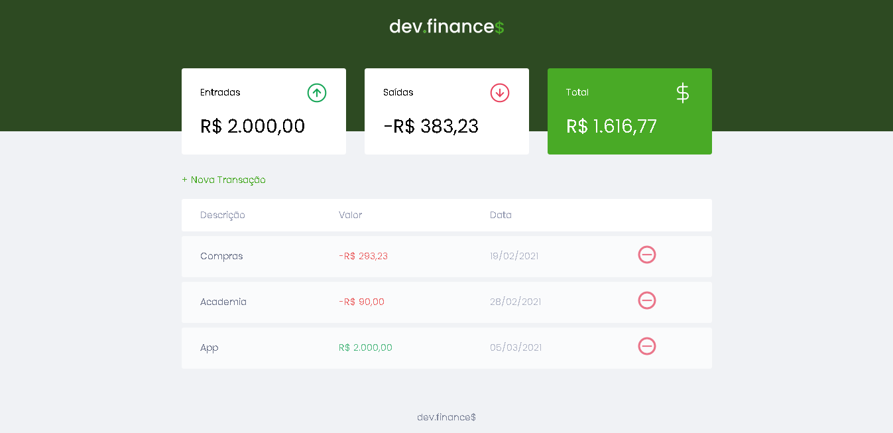

# dev.finance

  

Sistema feito seguindo a maratona Discover e com algumas mudanças por mim no JavaScript para práticar.

O propósito desse sistema é somar todos os ganhos, somar todos os gastos e depois depois fazer o cálculo entre os dois pra saber qual é o saldo atual.

O usuário coloca o nome do gasto ou ganho, a data e o valor e com isso as informações são listadas dando a opção de excluir e fazendo o cálculo assim que o item é cadastrado.
